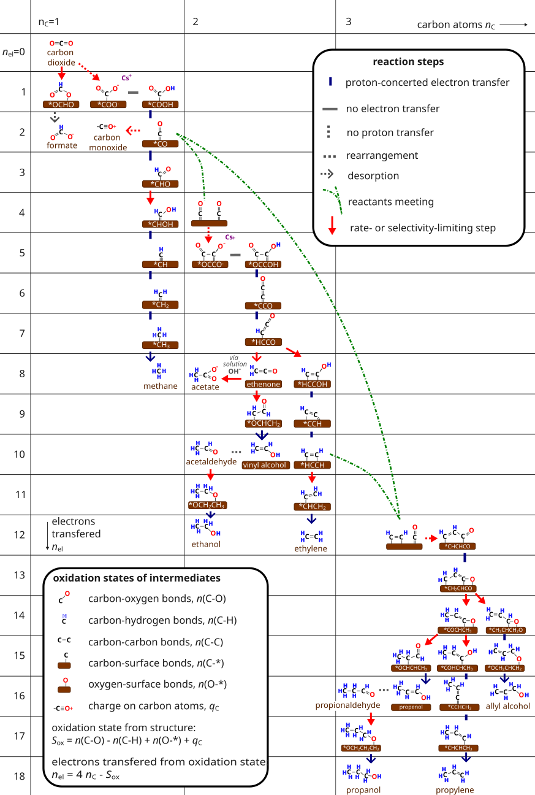

# CO2_reduction_pathways

This repository contains the vector graphics files for our CO2 reduction mechanism figures. 

Our up-to-date best guess (as of December 30, 2024) for the CO2 reduction pathway to all significant products (C1, C2, and C3) is [Figure 1](Seger2025_ACSEL/fig1_CO2_reduction_mechanisms.svg) form [Seger, Kastlunger, Bagger, and Scott, ACSEL, 2025](https://doi.org/10.1021/acsenergylett.4c03599) (shown here below).

This repository also contains:

- The zoom-in/alternative pathway figures from that article;
- The classic mechanistic compilation from [Nitopi et al, Chem Rev, 2019](https://doi.org/10.1021/acs.chemrev.8b00705); and
- the predecessor figure from [S. B. Scott's MSc thesis at DTU, 2016](https://sorenscott.wordpress.com/wp-content/uploads/2020/09/scotts-master.pdf).

The .svg figures are editable in the free open-source program Inkscape. The .vsdx opens in Inkscape as well, but unfortunately with some distortions and omissions.

We hope that this is useful!

